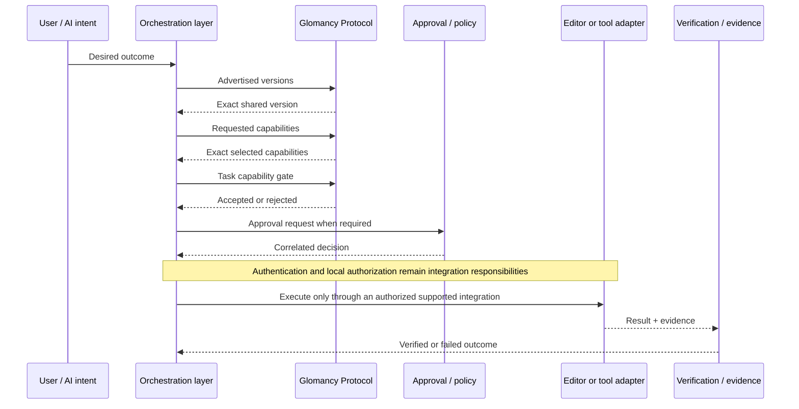

# See Glomancy Protocol work

Glomancy Protocol is easier to understand as a sequence of explicit decisions than as a list of schema files.

The repository therefore ships a dependency-free runnable demo that evaluates real public vectors and registry metadata. It is intentionally small enough to run locally in seconds and strict enough to fail if the showcased public contract drifts.

## Run it

From the repository root:

```bash
python3 examples/consumers/python/demo_flow.py
```

Representative output:

```text
Glomancy Protocol — runnable public flow
1. handshake       PASS  selected wire version: 0.4.0
2. capabilities    PASS  selected: editor.read@1.0.0, result.evidence@1.0.0
3. task gate       PASS  accepted: true
4. approval        PASS  accepted=true authorized=true
5. evidence        PASS  evidence.record -> urn:glomancy:protocol:evidence.record:1.0.0

Boundary: protocol validation/capability selection is not editor authorization.
A real integration must still enforce authentication, local policy, execution, and verification.
```

For machine-readable output:

```bash
python3 examples/consumers/python/demo_flow.py --json
```

The JSON output includes the exact public vector case and registry source used for every step, so a downstream reviewer can trace the demonstration back to the versioned contract.

## What the demo actually evaluates

The demo does not print hard-coded success lines. It independently evaluates public decisions already covered by the language-neutral vector suite:

1. **Advertised wire-version selection** — selects only a version explicitly advertised by both peers.
2. **Exact capability negotiation** — selects exact `name + version` matches and preserves required/optional semantics.
3. **Task-time capability gate** — verifies that a task requests only capabilities selected for the session.
4. **Approval correlation and expiry** — checks the approval ID, task ID, decision value, and expiry boundary.
5. **Evidence contract resolution** — resolves the published `evidence.record` schema identity and SHA-256 from the canonical registry.

If the independent consumer disagrees with the published expected outcome, the demo exits non-zero.

## The boundary in one picture



The public repository covers the protocol-visible contract around this boundary. It intentionally does **not** contain the private Glomancy planner/orchestrator, model-provider runtime, credentials, billing, Unreal mutation implementation, or commercial desktop runtime.

## Why this matters for editor integrations

An AI-to-editor system is not trustworthy merely because it can generate a plausible command. A production-oriented integration needs to know which protocol version is active, what the peer actually supports, whether the task asks for a capability that was negotiated, whether approval belongs to the same task and is still valid, and what evidence describes the result.

Glomancy Protocol makes those decisions explicit and independently testable.

For a concrete Unreal Engine boundary architecture, see [Unreal Integration Boundary](UNREAL_INTEGRATION_BOUNDARY.md). For language-neutral implementation details, see [Consumer Integration Guide](INTEGRATION_GUIDE.md) and [Consumer Conformance Vectors](CONSUMER_VECTORS.md).

## What this demo does not claim

This demo is evidence that the public protocol decisions are executable and reproducible. It is **not**:

- a demonstration of the private Glomancy application executing an Unreal Engine mutation;
- proof of authentication, sandboxing, or local authorization;
- a certification or formal security proof;
- evidence of independent third-party adoption.

Those boundaries are kept explicit on purpose.
